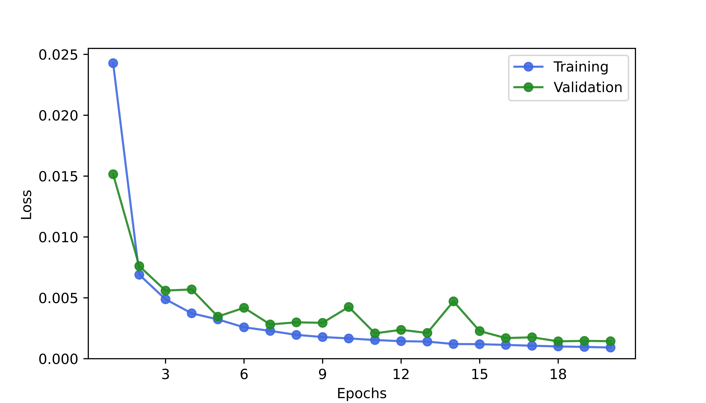

### Problem Description
The objective of this project is to detect anomalies, such as cracks or defects, in sheet metal parts. The dataset includes both defective and non-defective samples. The anomaly detection tool aims to distinguish these cases with high precision and recall.

### Performance Summary
	AUC	   Threshold	True Positive Rate (TPR)	False Positive Rate (FPR)
	0.96	0.335	        0.969	                    0.107

The most popular metric to evaluate anomaly detection performance is the area under the curve (AUC) (Bergmann et al., 2021), because this metric is not particularly sensitive to class imbalance

Model demonstrates strong performance in detecting anomalies:

AUC = 0.96: Indicates excellent overall classification ability.

TPR ≈ 0.97: The model correctly identifies the majority of actual anomalies.

FPR ≈ 0.11: The model produces relatively few false positives.

This balance highlights effectiveness in identifying defective parts while minimizing unnecessary false alarms.

#### Anomaly Score Threshold Dynamically set by the Metrics

The anomaly score distributions (densities) are plotted together with the threshold bar to analyze the scale on which these distributions overlap and trace changes in distribution shapes according to changes in hyperparameters.

### Train and Validation Loss

### Model Architecture

